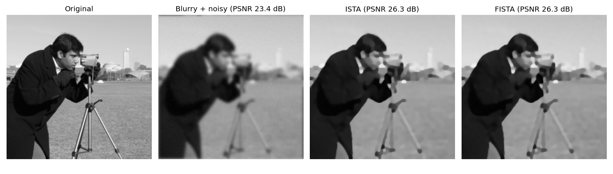
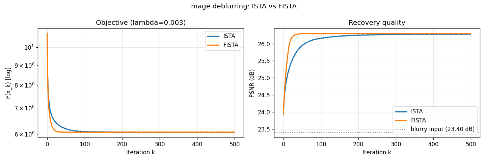
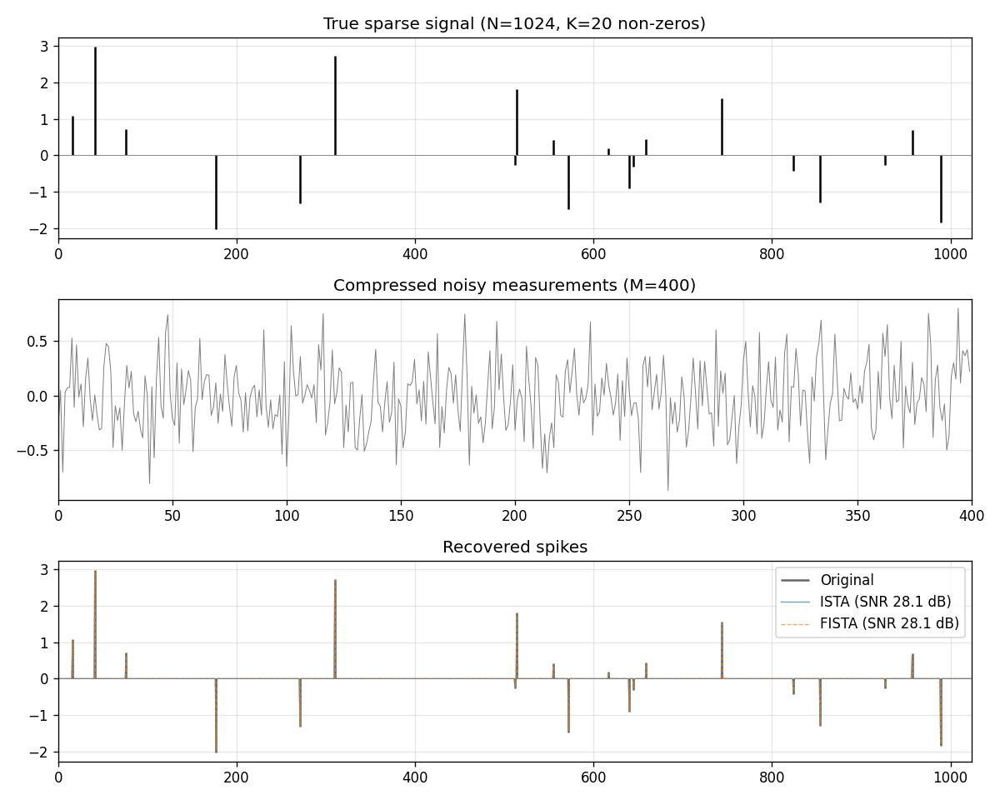
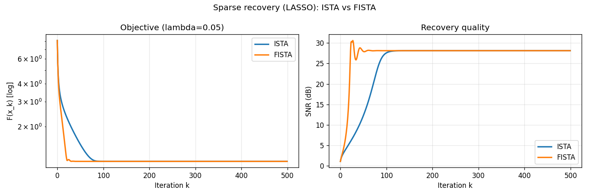

<div align="center">

<br>

# `Proximal Methods in Practice`

### **ISTA** vs **FISTA** — on two real linear inverse problems

<br>


<br>

*Optimization Techniques for Data Science · BMSCE · 2026*

</div>

---

<div align="center">

### **Team&nbsp;5**

| <picture>👨‍💻</picture> Name | USN |
|:---:|:---:|
| **Richik C** | `1BM23CD050` |
| **Suraj B** | `1BM23CD061` |
| **Sushant Deo** | `1BM23CD062` |
| **Trishul J** | `1BM23CD066` |

</div>

---

## ✦ &nbsp; What this is

A two-part interactive demo comparing the **Iterative Shrinkage-Thresholding Algorithm** (ISTA) against its accelerated cousin **FISTA**, applied to the exact problems that motivated them in the literature — *image deblurring* and *sparse signal recovery*. Instead of running a notebook and squinting at matplotlib, we wired the solvers into a Python backend that **streams every iteration over Server-Sent Events** to a Next.js frontend, so you actually *watch* the algorithms converge in real time and see why the **O(1/k²)** rate matters in practice.

Both demos solve the canonical composite-objective minimization from Module 3:

```math
                  min   f(x) + g(x)
                   x
```

where `f` is smooth (a least-squares data-fit term, gradient-Lipschitz with constant `L`) and `g` is convex but non-smooth (the regularizer — TV or `ℓ₁`). ISTA and FISTA both attack this with the proximal-gradient recipe; FISTA just adds Nesterov-style momentum on top.

---

## ✦ &nbsp; The two demos

### **1. Image Deblurring** &nbsp;·&nbsp; *2D, TV-regularized*

We start from a clean grayscale image, apply a known Gaussian blur kernel `A`, add noise, and ask the solver to recover the original.

```math
   min   ½ ‖ A x − y ‖²  +  λ · TV(x)
    x         ───────       ─────────
              data fit       prior
```

The **prox of TV** has no closed form, so we solve it inexactly with **Chambolle's dual algorithm** (`scikit-image`) — only the outer ISTA / FISTA loop is ours. This pairing is the example from the original Beck-Teboulle 2009 FISTA paper.

### **2. Sparse Signal Recovery** &nbsp;·&nbsp; *1D, LASSO via random measurements*

Compressed-sensing style. A sparse spike signal `x*` of length `N` is observed through a random Gaussian sensing matrix `A ∈ ℝ^{M×N}` with `M < N` — an under-determined system.

```math
   min   ½ ‖ A x − y ‖²  +  λ · ‖x‖₁
    x
```

The prox of `‖·‖₁` is closed-form — **soft-thresholding** — which we wrote from scratch. We picked this after realizing our original *wavelet denoising* idea collapses to a single soft-threshold step under an orthonormal basis (no comparison to be made).

---

## ✦ &nbsp; Results

> Generated by the verification harness `backend/verify.py`. These are unedited.

### **Deblurring**

<table>
<tr>
<td align="center"><b>Recovered images</b></td>
</tr>
<tr>
<td></td>
</tr>
<tr>
<td align="center"><b>Convergence — objective &amp; PSNR vs iteration</b></td>
</tr>
<tr>
<td></td>
</tr>
</table>

> 🟧 **FISTA hits the optimal PSNR (~26.3 dB) in ~50 iterations.**  
> 🟦 ISTA needs **~250 iterations** to reach the same neighborhood — a **5×** speedup on the same prox computation.

### **Sparse Recovery**

<table>
<tr>
<td align="center"><b>True signal &amp; recovery</b></td>
</tr>
<tr>
<td></td>
</tr>
<tr>
<td align="center"><b>Convergence — objective &amp; SNR vs iteration</b></td>
</tr>
<tr>
<td></td>
</tr>
</table>

> Both algorithms recover all 20 spikes to within numerical precision (**SNR ≈ 28 dB**) — but FISTA gets there in roughly an order-of-magnitude fewer iterations.

### **Live Web UI**

The frontend is a Next.js 15 app with a dark / earth-tone aesthetic inspired by mlflow.org. SSE streams each iteration to the browser, so the recovered image and three convergence panels (`F(x)`, `PSNR`, `SSIM`) animate in lockstep with the solver:

```
┌─────────────────────────────────────────────────────────────────┐
│  proximal methods                       deblur · recover · race │
├─────────────────────────────────────────────────────────────────┤
│                                                                 │
│   Image Deblurring                                              │
│   ½‖Ax − y‖² + λ TV(x)                                          │
│                                                                 │
│   ┌──────────┐  ┌──────────┐  ┌──────────┐                      │
│   │ original │  │  blurry  │  │ recovered│   ← live image       │
│   └──────────┘  └──────────┘  └──────────┘                      │
│                                                                 │
│   F(x_k) [log]    PSNR (dB)        SSIM                         │
│    ┃              ┃                 ┃                            │
│    ┃▁▁▁▁▁▁▁▁    ┃     ▔▔▔▔▔     ┃   ▔▔▔▔▔                       │
│    ┗━━━━━━━━     ┗━━━━━━━━━━━     ┗━━━━━━━━━━                   │
│                                                                 │
└─────────────────────────────────────────────────────────────────┘
```

> *To capture live UI screenshots of your local run, drop `landing.png`, `deblur.png`, and `race.png` into `screenshots/ui/` and they will appear inline in this section.*

---

## ✦ &nbsp; How to run it

You'll need **Python 3.10+** and **Node 18+** — two terminals.

### 🐍 &nbsp;Backend

```bash
cd backend
python -m venv .venv
.venv/Scripts/activate           # Windows
# source .venv/bin/activate      # macOS / Linux

pip install -r requirements.txt
python -m uvicorn main:app --reload --port 8000
```

Backend lives on `http://localhost:8000`. Hit `/health` to confirm it's up.

### ⚛️ &nbsp;Frontend

```bash
cd frontend
npm install
npm run dev
```

Open `http://localhost:3000` &nbsp;→&nbsp; landing page &nbsp;→&nbsp; click into `deblur`, `recover`, or `race`.

### 🧪 &nbsp;Sanity check *(optional)*

```bash
cd backend
python verify.py
```

Regenerates the four result plots in `screenshots/` from scratch — useful for confirming the install is clean.

---

## ✦ &nbsp; Project layout

```
Team-5/
├── README.md                  ← you are here
├── .gitignore
│
├── backend/                   🐍  Python · FastAPI · NumPy / SciPy
│   ├── main.py                ← FastAPI app + SSE endpoints
│   ├── deblur.py              ← ISTA/FISTA for image deblurring
│   ├── denoise.py             ← ISTA/FISTA for LASSO sparse recovery
│   ├── operators.py           ← Gaussian blur & random measurement ops
│   ├── prox.py                ← Proximal operators (soft-thresh, TV wrapper)
│   ├── metrics.py             ← PSNR, SSIM, SNR, MSE
│   ├── verify.py              ← End-to-end verification harness
│   ├── presets/               ← Built-in test images & sparse signals
│   └── requirements.txt
│
├── frontend/                  ⚛️  Next.js 15 · TypeScript · Tailwind · Recharts
│   ├── app/                   ← App-router pages
│   │   ├── page.tsx           ← landing
│   │   ├── deblur/page.tsx    ← image deblurring demo
│   │   ├── denoise/page.tsx   ← sparse recovery demo
│   │   └── race/page.tsx      ← side-by-side three-way race
│   ├── components/            ← charts, sliders, image canvases, races
│   ├── lib/                   ← API client + SSE handler + shared types
│   └── package.json
│
└── screenshots/               📊  Result plots (and ui/ slot for live UI shots)
```

---

## ✦ &nbsp; The theory in three lines

| Algorithm | Update rule | Rate on objective gap |
|:---|:---|:---:|
| **ISTA** | `x_{k+1} = prox_{αg}( x_k − α∇f(x_k) )` | `O(1/k)` |
| **FISTA** | ISTA on a Nesterov-mixed extrapolation point `y_k` | `O(1/k²)` |
| **In practice** | FISTA reaches `ε`-tolerance in **5–10× fewer iterations** | (measured, not handwaved) |

---

## ✦ &nbsp; References

| Paper | Year | Why it matters |
|:---|:---:|:---|
| **Beck & Teboulle** — *A Fast Iterative Shrinkage-Thresholding Algorithm for Linear Inverse Problems* (SIAM J. Imaging Sci.) | 2009 | The foundational **FISTA** paper. Both demo problems come straight from here. |
| **Daubechies, Defrise & De Mol** — *An iterative thresholding algorithm for linear inverse problems with a sparsity constraint* (Comm. Pure Appl. Math.) | 2004 | The original **ISTA** proof. |
| **Chambolle** — *An algorithm for total variation minimization and applications* (J. Math. Imaging Vis.) | 2004 | The **TV prox** dual algorithm we use. |
| **Parikh & Boyd** — *Proximal Algorithms* (Foundations and Trends in Optimization) | 2014 | The standard reference for everything **prox**. |

---

<div align="center">

<br>

*Built for the Optimization Techniques for Data Science course.*  
*BMS College of Engineering, 2026.*

<br>

`ISTA  ━━━━━━━━━━━━━ ⬤ ━━━━━━━━━━━━━━━━━━━━━━━━━━━━ O(1/k)`  
`FISTA ━━━ ⬤ ━━━━━━━━━━━━━━━━━━━━━━━━━━━━━━━━━━━━━ O(1/k²)`

</div>
