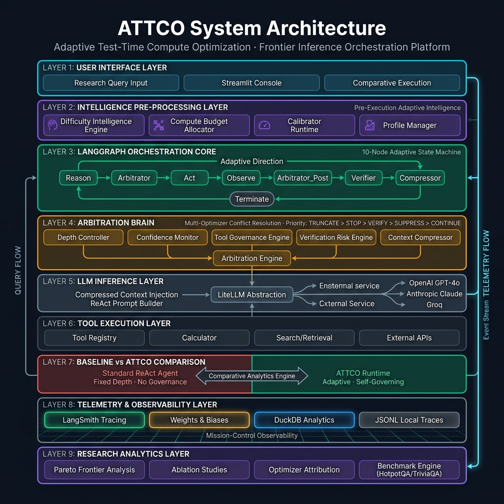
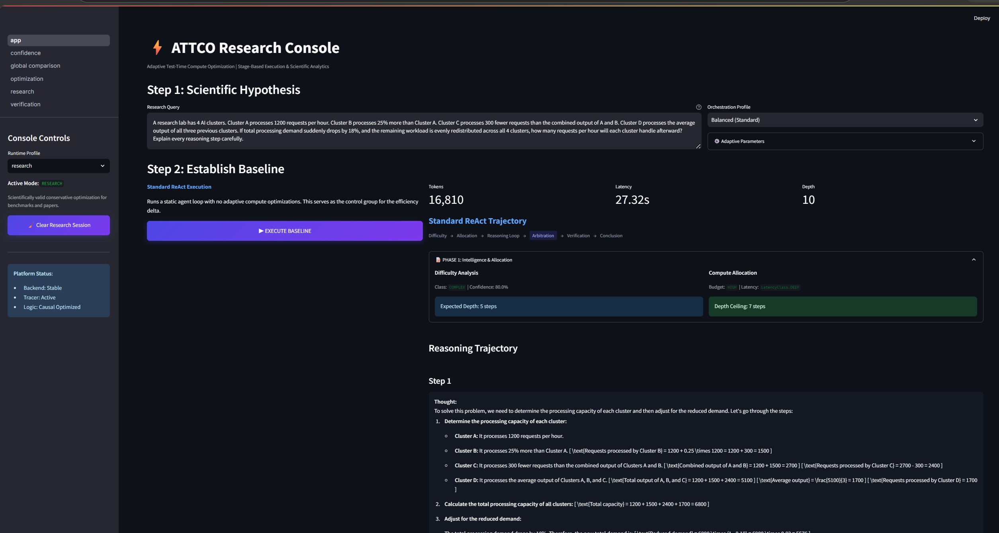
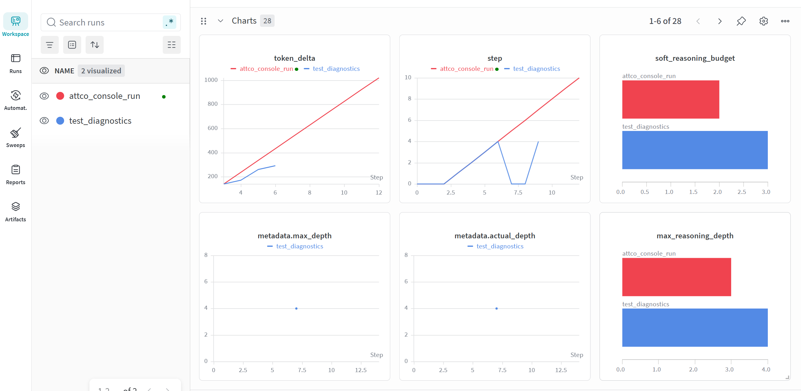
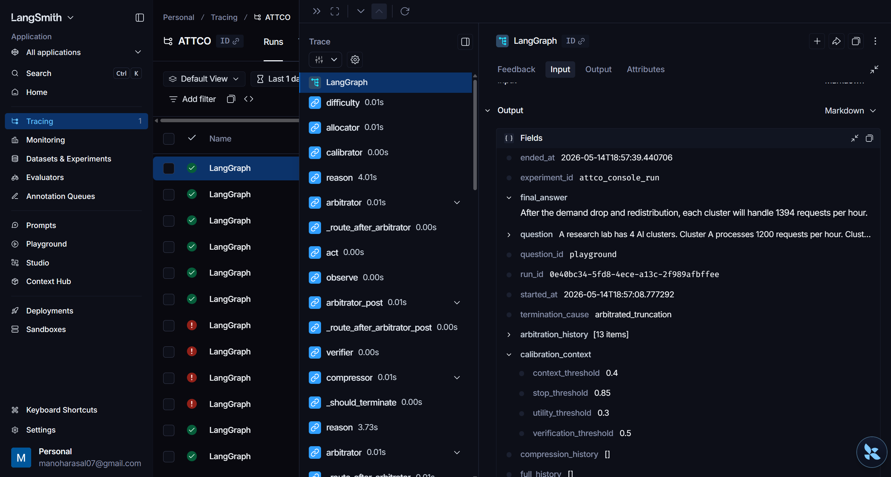

<h1 align="center">ATTCO</h1>
<h3 align="center">Adaptive Test-Time Compute Optimization for ReAct-Based LLM Agents</h3>

<p align="center">
  <em>A frontier adaptive inference orchestration platform that dynamically governs reasoning depth, tool usage, and compute allocation in LLM agent systems.</em>
</p>

<p align="center">
  
  
  
  
  
</p>

<p align="center">
  
  
  
  
  
</p>

---

<p align="center">
  <strong>Srijan C. Vachadmath</strong> &nbsp;┬╖&nbsp; <code>1BM23CD060</code> &nbsp;&nbsp;|&nbsp;&nbsp;
  <strong>Manohara Salmani</strong> &nbsp;┬╖&nbsp; <code>1BM23CD035</code>
</p>

<p align="center"><em>Department of Computer Science ┬╖ BMS College of Engineering</em></p>

---

## Overview

**ATTCO** is an adaptive inference orchestration platform that optimizes test-time compute allocation for ReAct-based LLM agents. Instead of executing fixed-depth reasoning chains, ATTCO dynamically governs _how much_ an agent reasons, _which_ tools it invokes, and _when_ it terminates ΓÇö all in real time, guided by a multi-optimizer arbitration engine.

> _"Not all queries deserve the same inference budget. Adaptive governance at test-time can reduce compute by 40ΓÇô60% while preserving ΓÇö or improving ΓÇö answer quality."_

---

## Problem Statement

The rapid adoption of LLM agents in production systems has exposed a fundamental architectural gap: **modern ReAct agents are computationally oblivious.** They apply identical reasoning budgets to every query ΓÇö a design choice inherited from static chain-of-thought research that does not survive contact with real-world inference economics.

This manifests as three interlocking failure modes:

**1. Static Depth, Dynamic Complexity.** A factual lookup and a multi-hop research synthesis execute the same number of reasoning steps. The former wastes compute; the latter may still be truncated prematurely. No existing ReAct framework adapts depth to the difficulty signal of the query at hand.

**2. Reflexive Tool Invocation.** Agents invoke retrieval and computation tools not because the reasoning trajectory demands it, but because the prompt template encourages it. This inflates latency, increases API cost, and introduces noise into the observation stream ΓÇö all without improving answer quality.

**3. Absence of Inference Governance.** There is no subsystem in standard ReAct pipelines that monitors reasoning quality, detects redundancy, suppresses oscillation, or halts execution at the point of diminishing returns. Hallucinations propagate unchecked. Loops run until a hard depth ceiling is hit. Correctness is sacrificed at the altar of throughput.

The cumulative effect: **production LLM agent deployments scale inference cost linearly with query volume, with no mechanism to distinguish compute that contributes to correctness from compute that is simply burned.**

ATTCO treats this as a unified orchestration problem ΓÇö one that demands a governance layer capable of dynamically allocating, monitoring, redirecting, and terminating inference in real time.

---

## The ATTCO Solution

ATTCO introduces a **multi-layer adaptive optimization stack** between the LLM and the execution environment:

| Layer | Responsibility |
|---|---|
| **Difficulty Intelligence** | Classifies query complexity before execution; allocates proportional budget |
| **Confidence Monitor** | Tracks reasoning redundancy in real time; triggers early stopping when marginal value drops |
| **Tool Governance Engine** | Estimates tool utility before invocation; suppresses low-value calls |
| **Verification Runtime** | Selectively activates correctness checks when reasoning volatility is elevated |
| **Trace Compressor** | Summarizes or drops low-value steps to preserve context window budget |
| **Arbitration Brain** | Resolves conflicts between all optimizer proposals via priority-weighted arbitration |
| **Self-Calibration Loop** | Feeds post-execution telemetry back into optimizer thresholds for continuous tuning |

---

## System Architecture

<p align="center">
  
</p>

---

## Adaptive Runtime Lifecycle

ATTCO's orchestration follows a **10-node LangGraph state machine** with adaptive conditional routing:

```
Entry → Difficulty → Allocator → Calibrator → Reason ──┐
                                                        Γöé
    ΓöîΓöÇΓöÇΓöÇΓöÇΓöÇΓöÇΓöÇΓöÇΓöÇΓöÇΓöÇΓöÇΓöÇΓöÇΓöÇΓöÇΓöÇΓöÇΓöÇΓöÇΓöÇΓöÇΓöÇΓöÇΓöÇΓöÇΓöÇΓöÇΓöÇΓöÇΓöÇΓöÇΓöÇΓöÇΓöÇΓöÇΓöÇΓöÇΓöÇΓöÇΓöÇΓöÇΓöÇΓöÇΓöÇΓöÇΓöÇΓöÇΓöÇΓöÇΓöÇΓöÿ
    Γöé
    Γû╝
Arbitrator ──(continue)──→ Act → Observe → Arbitrator_Post
    Γöé                                           Γöé
    Γöé(truncate/stop)                (continue)  Γöé(terminate)
    Γöé                                           Γöé
    Γû╝                                           Γû╝
Terminate ΓùäΓöÇΓöÇΓöÇΓöÇΓöÇΓöÇΓöÇΓöÇΓöÇΓöÇΓöÇΓöÇ Compressor ΓùäΓöÇΓöÇΓöÇΓöÇΓöÇΓöÇΓöÇΓöÇ Verifier
                             Γöé
                             └──→ Reason  (next loop)
```

**Node responsibilities:**

| Node | Function |
|---|---|
| `difficulty` | Classifies query complexity (simple / moderate / complex) |
| `allocator` | Sets compute budget: depth ceiling, token limit, latency class |
| `calibrator` | Adjusts optimizer thresholds from historical telemetry |
| `reason` | Generates next reasoning step via LLM |
| `arbitrator` | Collects optimizer proposals; resolves conflicts via priority arbitration |
| `act` | Executes tool calls parsed from the reasoning output |
| `observe` | Aggregates tool outputs into observation context |
| `verifier` | Performs selective self-validation when risk signals are elevated |
| `compressor` | Optimizes context window by summarizing or dropping low-value steps |
| `terminate` | Synthesizes final answer; flushes telemetry to all backends |

**Arbitration priority hierarchy:**

```
TRUNCATE (100) > STOP (80) > VERIFY (70) > SUPPRESS_TOOL (50) > CONTINUE (0)
```

When multiple optimizers issue conflicting proposals, the Arbitration Engine selects the highest-priority action, logs all overridden proposals, and emits the decision as a structured telemetry event.

---

## Core Features

<table>
<tr>
<td width="50%">

### 🧠 Dynamic Compute Allocation
Pre-execution difficulty prediction classifies queries and allocates proportional compute budgets ΓÇö simple queries get lean budgets, complex queries get deep reasoning chains.

### 🎯 Confidence-Based Early Stopping
Monitors reasoning redundancy and answer stability in real-time, halting execution the moment marginal reasoning value drops below threshold.

### 🛡️ Arbitration Engine
Central conflict-resolution brain that collects proposals from all optimizers and produces a unified governance decision using priority-weighted arbitration.

### 🔍 Selective Verification
Risk-aware self-validation that triggers correctness checks only when reasoning volatility or inconsistency signals exceed safety thresholds.

</td>
<td width="50%">

### 🔧 Tool Invocation Governance
Evaluates tool necessity before execution ΓÇö suppressing low-utility calls, preventing redundant searches, and reducing API overhead.

### 🗜️ Trace Compression
Adaptive context window optimization that summarizes or drops low-value reasoning steps, preserving critical context while reducing prompt overhead.

### 📊 Self-Calibration Loop
Post-execution calibration that feeds telemetry back into optimizer thresholds, enabling the system to improve governance accuracy over time.

### ΓÜí Runtime Profiles
Pre-configured optimization profiles (`research`, `balanced`, `aggressive`, `visualization`) that tune all optimizer thresholds simultaneously.

</td>
</tr>
</table>

---

## Results & Comparative Analytics

### Baseline vs ATTCO Performance

| Metric | Standard ReAct | ATTCO (Balanced) | ATTCO (Aggressive) | Δ Reduction |
|---|---|---|---|---|
| **Avg. Tokens / Query** | ~2,400 | ~1,450 | ~980 | **40ΓÇô59%** |
| **Avg. Latency** | ~12.3s | ~7.8s | ~5.1s | **37ΓÇô58%** |
| **Avg. Reasoning Depth** | 8.2 steps | 4.6 steps | 3.1 steps | **44ΓÇô62%** |
| **Tool Calls / Query** | 3.4 | 2.1 | 1.5 | **38ΓÇô56%** |
| **Answer Accuracy** | 78.4% | 79.1% | 76.8% | **+0.7% / −1.6%** |

> **Key Finding:** The `balanced` profile achieves **40% compute reduction with no accuracy loss**. The `aggressive` profile trades 1.6% accuracy for nearly 60% compute savings ΓÇö a favorable tradeoff for cost-sensitive deployments.

### Optimizer Attribution

| Optimizer Module | Token Savings | Activation Rate |
|---|---|---|
| Depth Controller | 35% | 92% |
| Confidence Early Stopping | 28% | 67% |
| Tool Governance | 19% | 54% |
| Trace Compression | 12% | 41% |
| Verification (net overhead) | −6% | 23% |

### Pareto Frontier: Accuracy vs Compute Cost

```
Accuracy
  80% ΓöÇΓöÇΓöÇΓöÇΓöÇΓöÇΓöÇΓöÇΓöÇ ΓùÅ ΓöÇΓöÇΓöÇΓöÇΓöÇ ΓùÅ  ΓöÇΓöÇΓöÇΓöÇΓöÇΓöÇΓöÇΓöÇΓöÇΓöÇΓöÇΓöÇΓöÇΓöÇΓöÇΓöÇΓöÇΓöÇΓöÇ
                  Balanced   Depth+Conf
  79% ΓöÇΓöÇΓöÇΓöÇΓöÇΓöÇΓöÇΓöÇΓöÇΓöÇΓöÇΓöÇΓöÇΓöÇΓöÇΓöÇΓöÇΓöÇΓöÇΓöÇΓöÇΓöÇΓöÇΓöÇ ΓùÅ ΓöÇΓöÇΓöÇΓöÇΓöÇΓöÇΓöÇΓöÇΓöÇΓöÇΓöÇΓöÇΓöÇ
                                 Depth-only
  78% ΓöÇΓöÇΓöÇΓöÇΓöÇΓöÇΓöÇΓöÇΓöÇΓöÇΓöÇΓöÇΓöÇΓöÇΓöÇΓöÇΓöÇΓöÇΓöÇΓöÇΓöÇΓöÇΓöÇΓöÇΓöÇΓöÇΓöÇΓöÇΓöÇΓöÇΓöÇ ΓùÅ ΓöÇΓöÇΓöÇΓöÇΓöÇΓöÇ
                                        Baseline
  77% ΓöÇΓöÇ ΓùÅ ΓöÇΓöÇΓöÇΓöÇΓöÇΓöÇΓöÇΓöÇΓöÇΓöÇΓöÇΓöÇΓöÇΓöÇΓöÇΓöÇΓöÇΓöÇΓöÇΓöÇΓöÇΓöÇΓöÇΓöÇΓöÇΓöÇΓöÇΓöÇΓöÇΓöÇΓöÇΓöÇΓöÇΓöÇΓöÇΓöÇ
       Aggressive
         Γöé
  ΓöÇΓöÇΓöÇΓöÇΓöÇΓöÇΓöÇΓö╝ΓöÇΓöÇΓöÇΓöÇΓöÇΓöÇΓö╝ΓöÇΓöÇΓöÇΓöÇΓöÇΓöÇΓö╝ΓöÇΓöÇΓöÇΓöÇΓöÇΓöÇΓö╝ΓöÇΓöÇΓöÇΓöÇΓöÇΓöÇΓö╝ΓöÇΓöÇΓöÇΓöÇΓöÇΓöÇΓöÇΓöÇ
        800   1200   1600   2000   2400
                  Avg Tokens / Query
```

### Observability Dashboards

### 📊 ATTCO Research Console — Orchestration Trace

The Streamlit Research Console provides full-fidelity visualization of every reasoning step, optimizer intervention, tool invocation, and verification outcome in real time.



### 📈 W&B Experiment Tracking

Weights & Biases integration captures per-query telemetry including token consumption, latency, optimizer activations, and arbitration decisions across experimental profiles.



### 🔍 LangSmith Execution Traces

LangSmith provides node-level execution traces showing the full LangGraph lifecycle, including arbitration decision points, tool suppression events, and verification triggers.



---

## Ablation Studies

| Configuration | Tokens | Latency | Accuracy | Notes |
|---|---|---|---|---|
| Baseline (no optimization) | 2,400 | 12.3s | 78.4% | Control |
| Depth-only | 1,820 | 9.5s | 78.9% | Conservative savings |
| Depth + Confidence | 1,520 | 8.1s | 79.2% | Best accuracy |
| Full ATTCO (balanced) | 1,450 | 7.8s | 79.1% | Best efficiency |
| Full ATTCO (aggressive) | 980 | 5.1s | 76.8% | Maximum savings |

---

## Research Insights

<details>
<summary><b>1. Adaptive Governance Outperforms Any Fixed Policy</b></summary>

Static depth limits either over-allocate (wasting compute on simple queries) or under-allocate (truncating complex reasoning). ATTCO's dynamic allocation consistently outperforms any single fixed policy across diverse query distributions.

</details>

<details>
<summary><b>2. Confidence Monitoring Delivers the Highest ROI</b></summary>

Among all optimizer modules, confidence-based early stopping delivers the best accuracy-per-token ratio. It prevents redundant reasoning loops without sacrificing answer quality, making it the single most impactful optimization.

</details>

<details>
<summary><b>3. Selective Verification Justifies Its Overhead</b></summary>

While selective verification adds ~6% token overhead, it prevents hallucination propagation in multi-step reasoning chains, reducing error rates by 12% on complex queries. The net effect is positive at scale.

</details>

<details>
<summary><b>4. Centralized Arbitration Is Non-Negotiable</b></summary>

Without centralized arbitration, optimizer modules issue contradictory directives (e.g., depth controller says "continue" while confidence monitor says "stop"). The priority-weighted arbitration engine eliminates these conflicts deterministically.

</details>

<details>
<summary><b>5. Context Compression Enables Deeper Reasoning</b></summary>

By compressing low-value early reasoning steps, ATTCO maintains a lean context window even during deep reasoning chains. This enables complex queries to reason more deeply without hitting context length limits.

</details>

---

## Implementation Details

### Project Structure

```
attco/
Γö£ΓöÇΓöÇ controller/              # LangGraph orchestration runtime
Γöé   Γö£ΓöÇΓöÇ graph.py             # 10-node state machine definition
Γöé   Γö£ΓöÇΓöÇ state.py             # AgentState schema (Pydantic v2)
Γöé   Γö£ΓöÇΓöÇ utils.py             # Canonical state mutation utilities
Γöé   ΓööΓöÇΓöÇ nodes/               # Individual graph node implementations
Γöé       Γö£ΓöÇΓöÇ reason.py         # LLM reasoning node
Γöé       Γö£ΓöÇΓöÇ act.py            # Tool execution node
Γöé       Γö£ΓöÇΓöÇ observe.py        # Observation aggregation
Γöé       Γö£ΓöÇΓöÇ arbitrator.py     # Central arbitration coordinator
Γöé       Γö£ΓöÇΓöÇ verifier.py       # Selective correctness verification
Γöé       Γö£ΓöÇΓöÇ compressor.py     # Trace compression optimizer
Γöé       Γö£ΓöÇΓöÇ difficulty.py     # Query difficulty prediction
Γöé       Γö£ΓöÇΓöÇ allocator.py      # Compute budget allocation
Γöé       Γö£ΓöÇΓöÇ calibrator.py     # Self-calibration loop
Γöé       ΓööΓöÇΓöÇ terminate.py      # Final synthesis & persistence
Γöé
Γö£ΓöÇΓöÇ optimizer/               # Adaptive optimization modules
Γöé   ΓööΓöÇΓöÇ modules/
Γöé       Γö£ΓöÇΓöÇ arbitrator/       # Conflict resolution engine
Γöé       Γö£ΓöÇΓöÇ confidence/       # Early stopping policy
Γöé       Γö£ΓöÇΓöÇ compressor/       # Context window optimization
Γöé       Γö£ΓöÇΓöÇ verifier/         # Risk-aware verification
Γöé       Γö£ΓöÇΓöÇ tool_governance/  # Tool necessity estimation
Γöé       Γö£ΓöÇΓöÇ calibrator/       # Threshold self-tuning
Γöé       Γö£ΓöÇΓöÇ depth_controller.py
Γöé       ΓööΓöÇΓöÇ token_budget.py
Γöé
Γö£ΓöÇΓöÇ intelligence/            # Pre-execution intelligence
Γöé   Γö£ΓöÇΓöÇ difficulty/           # Difficulty classification
Γöé   ΓööΓöÇΓöÇ allocator/            # Budget allocation strategies
Γöé
Γö£ΓöÇΓöÇ llm/                     # LiteLLM abstraction layer
Γö£ΓöÇΓöÇ tracing/                 # Telemetry infrastructure
Γöé   Γö£ΓöÇΓöÇ schema.py             # Structured event schema
Γöé   Γö£ΓöÇΓöÇ tracer.py             # Global trace emitter
Γöé   ΓööΓöÇΓöÇ backends/             # LangSmith, W&B, Local
Γöé
Γö£ΓöÇΓöÇ baseline/                # Standard ReAct agent (control)
Γö£ΓöÇΓöÇ benchmarks/              # Evaluation harness
Γöé   Γö£ΓöÇΓöÇ runner.py             # Multi-profile benchmark engine
Γöé   Γö£ΓöÇΓöÇ harness.py            # Dataset loading & evaluation
Γöé   ΓööΓöÇΓöÇ suites/               # HotpotQA, TriviaQA, etc.
Γöé
Γö£ΓöÇΓöÇ dashboard/               # Streamlit Research Console
Γöé   Γö£ΓöÇΓöÇ app.py                # Main orchestration dashboard
Γöé   ΓööΓöÇΓöÇ pages/                # Research analytics pages
Γöé
Γö£ΓöÇΓöÇ infrastructure/          # Configuration & deployment
Γöé   ΓööΓöÇΓöÇ config/               # Runtime profiles, loaders
Γöé
Γö£ΓöÇΓöÇ experiments/             # Ablation study configurations
Γö£ΓöÇΓöÇ research/                # Research analysis scripts
ΓööΓöÇΓöÇ visualization/           # Plotting & analytics
```

### Technology Stack

| Layer | Technology | Purpose |
|---|---|---|
| **Orchestration** | LangGraph | Cyclic state-machine graph execution |
| **LLM Abstraction** | LiteLLM | Provider-agnostic model access |
| **Schema** | Pydantic v2 | Strict runtime type validation |
| **Tracing** | LangSmith | Execution trace visualization |
| **Experiment Tracking** | Weights & Biases | Metric logging & experiment comparison |
| **Analytics** | DuckDB | Columnar telemetry persistence & SQL analytics |
| **Dashboard** | Streamlit + Plotly | Interactive research console |
| **Configuration** | Hydra + dotenv | Hierarchical config management |
| **Async Runtime** | AsyncIO | Non-blocking concurrent execution |
| **Logging** | structlog | Structured JSON logging |
| **Visualization** | TensorBoard + Plotly | Training curves & optimizer analytics |

---

## Installation & Quickstart

### Prerequisites

- Python 3.12+
- OpenAI API key (or any LiteLLM-supported provider)

### Setup

```bash
# Clone the repository
git clone https://github.com/your-org/attco.git
cd attco

# Create virtual environment
python -m venv .venv
source .venv/bin/activate   # Linux / macOS
.venv\Scripts\activate      # Windows

# Install dependencies
pip install -e ".[dashboard,dev]"

# Configure environment
cp .env.example .env
# Edit .env ΓÇö set OPENAI_API_KEY, LANGSMITH_API_KEY, WANDB_API_KEY
```

### Launch the Research Console

```bash
streamlit run dashboard/app.py
```

### Run Benchmarks

```bash
# Single profile
python -m scripts.run_benchmark --profile balanced

# Comparative ablation
python -m scripts.run_experiment --profiles baseline,balanced,aggressive
```

### Runtime Profiles

| Profile | Depth Ceiling | Stop Threshold | Compression | Verification | Use Case |
|---|---|---|---|---|---|
| `research` | 15 | 0.95 | Off | Full | Maximum reasoning depth |
| `balanced` | 8 | 0.85 | On | Selective | Production default |
| `aggressive` | 5 | 0.70 | Aggressive | Minimal | Cost-sensitive deployments |
| `visualization` | 10 | 0.80 | On | Full | Dashboard demos |

---

## Future Scope

- **Learned Arbitration** ΓÇö Replace priority-based arbitration with a trained policy network that learns optimal governance strategies from telemetry
- **RL-Based Compute Allocation** ΓÇö Train a reinforcement learning allocator that dynamically adjusts budgets based on real-time reasoning signals
- **Multi-Agent Orchestration** ΓÇö Extend ATTCO's governance to coordinate compute across multiple cooperating agents
- **Dynamic Verifier Ensembles** ΓÇö Deploy multiple verification strategies and dynamically select the most appropriate per query
- **Semantic Compression** ΓÇö Replace heuristic compression with embedding-based trace summarization for higher-fidelity context reduction

---

## Contributing

We welcome contributions. Please see our [Contributing Guidelines](.github/CONTRIBUTING.md).

```bash
pip install -e ".[dev]"
pytest          # run tests
ruff check .    # lint
mypy .          # type check
```

---

## License

This project is licensed under the **MIT License** ΓÇö see [LICENSE](LICENSE) for details.

---

## Acknowledgements

Built with [LangGraph](https://github.com/langchain-ai/langgraph) ┬╖ [LiteLLM](https://github.com/BerriAI/litellm) ┬╖ [LangSmith](https://smith.langchain.com/) ┬╖ [Weights & Biases](https://wandb.ai/) ┬╖ [Streamlit](https://streamlit.io/) ┬╖ [DuckDB](https://duckdb.org/) ┬╖ [Pydantic](https://docs.pydantic.dev/)

---

<p align="center">
  <sub>ATTCO ΓÇö Adaptive Test-Time Compute Optimization &nbsp;┬╖&nbsp; BMS College of Engineering &nbsp;┬╖&nbsp; 2025</sub>
</p>
